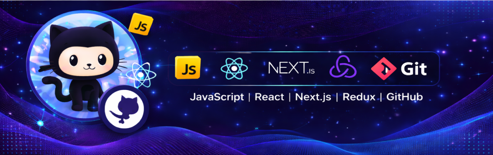

  

# Hi 👋 I'm Anaitullah

### 🚀 MERN Stack Developer | Full Stack Web Engineer

---

# 👨‍💻 About Me

I am a **MERN Stack Developer** passionate about building **modern, scalable, and high-performance web applications**.

I specialize in creating **full-stack solutions** using:

- MongoDB
- Express.js
- React.js
- Node.js

I also work with modern technologies like **Next.js, Redux, Prisma, PostgreSQL, Docker, and AWS** to build **production-ready applications**.

💡 My development philosophy focuses on:

- Clean and maintainable code
- Scalable architecture
- Performance optimization
- Intuitive UI/UX

I enjoy turning **ideas into real-world digital products** and continuously improving my skills by learning new technologies and building projects.

---

# 🛠 Tech Stack

### Frontend

### Backend

### Databases

### DevOps & Cloud

### Testing

### Tools

---

# 📊 GitHub Stats

---

# 📈 Most Used Languages

---

# 📊 GitHub Activity Graph

---

# 🐍 Contribution Snake

---

# ✍️ Random Dev Quote

---

# 🌐 Connect With Me

---

# 🚀 Current Focus

⚡ Building **scalable full-stack applications**

🧠 Learning **advanced system architecture**

🌍 Contributing to **open-source projects**

---

# ⭐ Support

If you like my projects, please consider **starring the repositories**.

It really helps and motivates me to build more.

---

### 💻 Happy Coding

